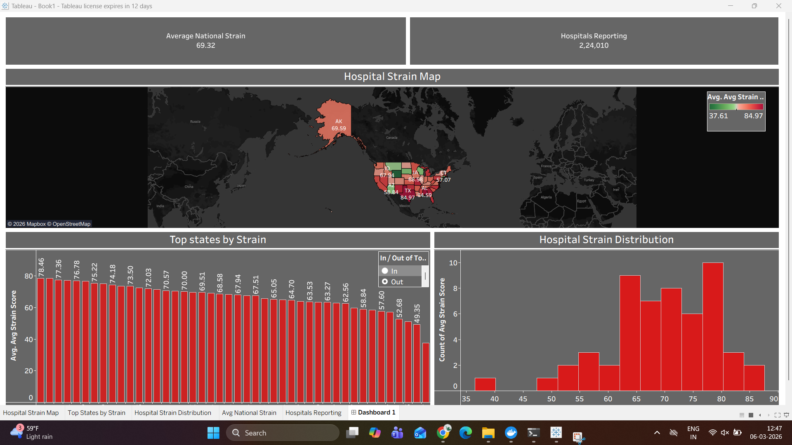
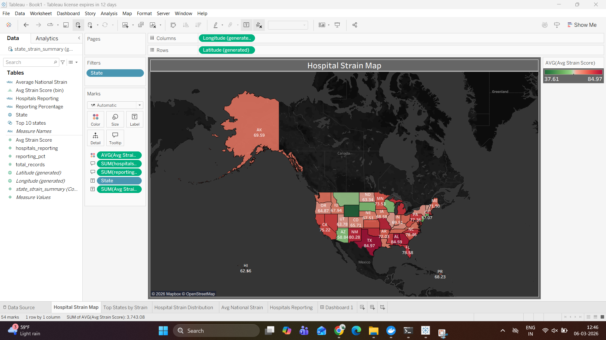
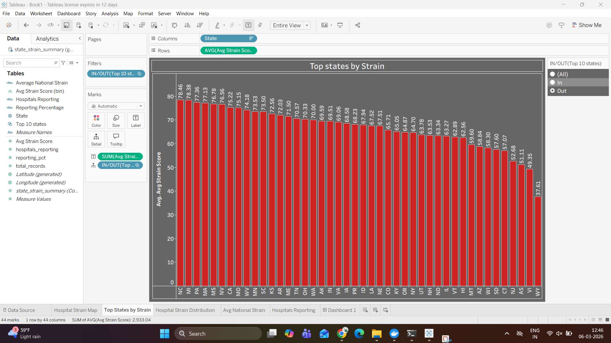
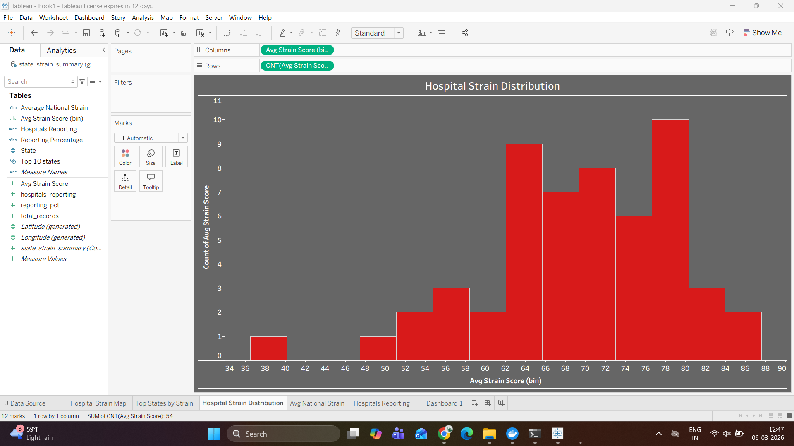

# US Hospital Strain Monitoring Pipeline

End-to-end healthcare data engineering pipeline that ingests CDC hospital operations data, calculates hospital strain metrics, and visualizes system pressure across U.S. states using Tableau dashboards.

Built with **Airflow, Docker, MinIO, PostgreSQL, and Tableau**.

---

## Architecture

CDC API  
↓  
Airflow DAG (Pipeline Orchestration)  
↓  
MinIO (Bronze Data Lake Storage)  
↓  
PostgreSQL (Analytics Warehouse)  
↓  
Tableau Dashboard (Visualization)

---

## Technologies Used

- Python
- Apache Airflow
- Docker
- MinIO (Object Storage)
- PostgreSQL
- SQL
- Tableau

---

## Pipeline Workflow

1. Hospital operations data is ingested from the CDC API.
2. Raw JSON data is stored in MinIO as the bronze layer.
3. Airflow processes hospital capacity metrics and calculates strain scores.
4. Processed data is stored in PostgreSQL analytics tables.
5. Tableau connects to PostgreSQL to visualize hospital strain insights.

---

## Key Features

- Automated data ingestion pipeline using Airflow
- Hospital strain scoring algorithm
- Data quality monitoring
- PostgreSQL analytics warehouse
- Interactive Tableau dashboard

---

## Dashboard Overview


## Hospital Strain Map


## Top States by Strain


## Strain Distribution

---

## Example SQL Query

```sql
SELECT state, AVG(strain_score)
FROM gold.hospital_strain_alerts
GROUP BY state
ORDER BY AVG(strain_score) DESC;
```

---

## Future Improvements

- Add streaming ingestion with Kafka
- Implement dbt transformation layer
- Add real-time alert notifications
- Deploy pipeline on cloud infrastructure

---

## Author

Akarsh Thota  
Master's in Management Information Systems  

Northern Illinois University

---

## Project Structure

healthcare-hospital-strain-pipeline
│
├── dags/                # Airflow DAG pipeline
├── docker/              # Docker configuration
├── sql/                 # Database initialization & queries
├── src/                 # Helper scripts
├── tableau/             # Tableau dashboard file
├── screenshots/         # Dashboard images for README
│
├── docker-compose.yml   # Local pipeline orchestration
├── README.md
└── .gitignore


